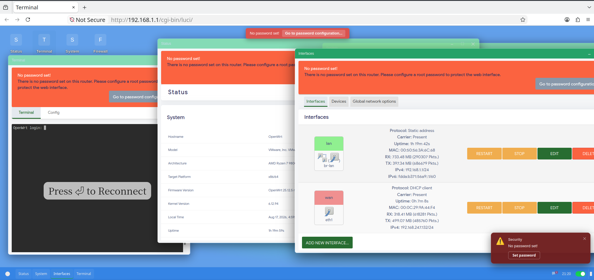
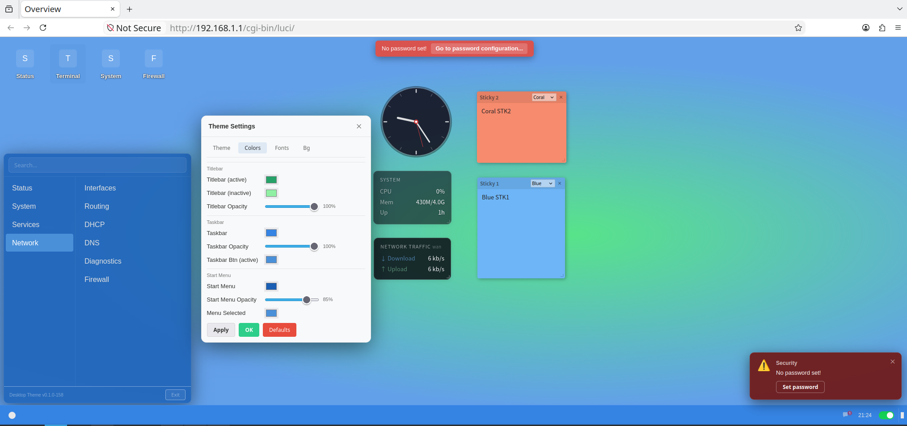
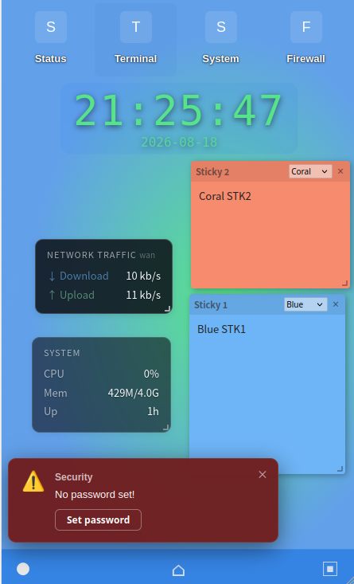
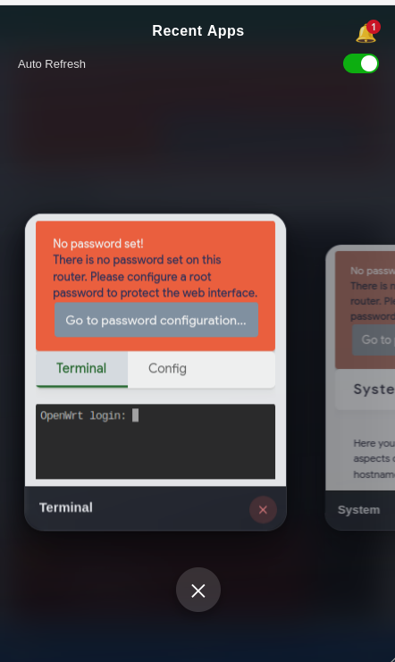

# luci-theme-desktop

A desktop-operating-system style theme for LuCI (OpenWrt web interface):
a persistent desktop shell with taskbar, start menu, draggable window
manager and desktop widgets. Every LuCI page runs inside an iframe window.

Works on **both LuCI runtimes** from a single package:
- **ucode** runtime — `.ut` templates
- **Lua** runtime — `.htm` templates

## Screenshots

### Desktop





### Mobile





## Tested on

- Official OpenWrt 25.12.5
- ImmortalWrt 25.12
- LEDE (OpenWrt 24.10)

## Requirements

- **LuCI** — official OpenWrt firmware ships without it; install first:
  `opkg install luci` or `apk add luci`
- **luci-lua-runtime** — the theme controller is Lua-based. On ucode-only
  LuCI (official OpenWrt 25.x) the theme API endpoints (settings save,
  notifications, changes) **silently fail** without the Lua compat layer.
  The package declares it as a dependency and installs it automatically;
  if it is missing, install it manually:
  `opkg install luci-lua-runtime` or `apk add luci-lua-runtime`

## Features

- Desktop shell: taskbar, start menu, window manager, desktop shortcuts
- Built-in widgets: clock, sticky notes, system info, net traffic
- Theme settings: colors, dark mode, fonts, wallpaper, mobile layout
- Auto-refresh control and notification management
- Installable terminal shortcut (ttyd) when missing
- Chinese + English UI

## Install

```sh
opkg install luci-theme-desktop_*.ipk          # opkg firmware
apk add --allow-untrusted luci-theme-desktop_*.apk   # apk firmware
uci set luci.main.mediaurlbase=/luci-static/desktop
uci commit luci
```

The post-install hook registers the theme and seeds the default desktop
settings.

## Development

AI-assisted contributors: read [`AGENTS.md`](AGENTS.md) first — architecture,
rules and gotchas for AI coding tools.

See `tests/README.md` for the test levels:
- **L1** — headless-browser unit tests, runs in CI on every push/PR
  (`node tests/run-headless.js`, needs Node + Firefox + geckodriver)
- **L2** — Lua runtime layer tests (optional, needs an OpenWrt device)
- **L3** — device deployment/smoke probes (optional, machine-specific)

## Reference

Parts of the code are adapted from
[luci-theme-argon](https://github.com/jerrykuku/luci-theme-argon)
by jerrykuku.

## License

Apache-2.0
